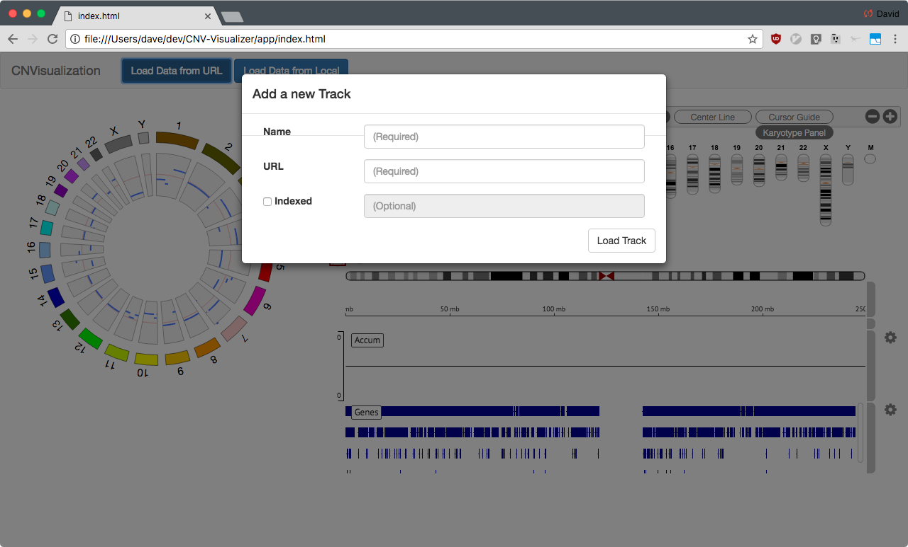
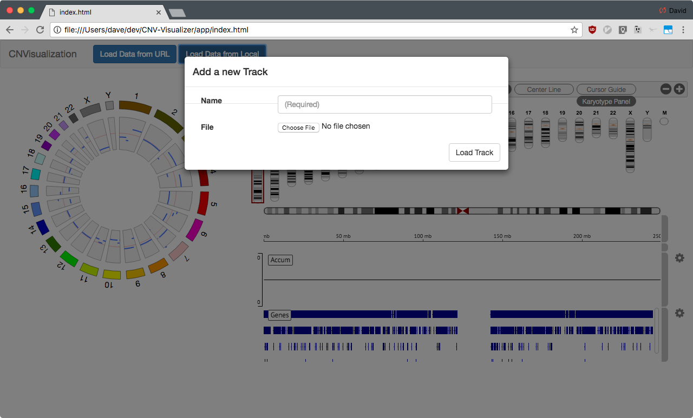
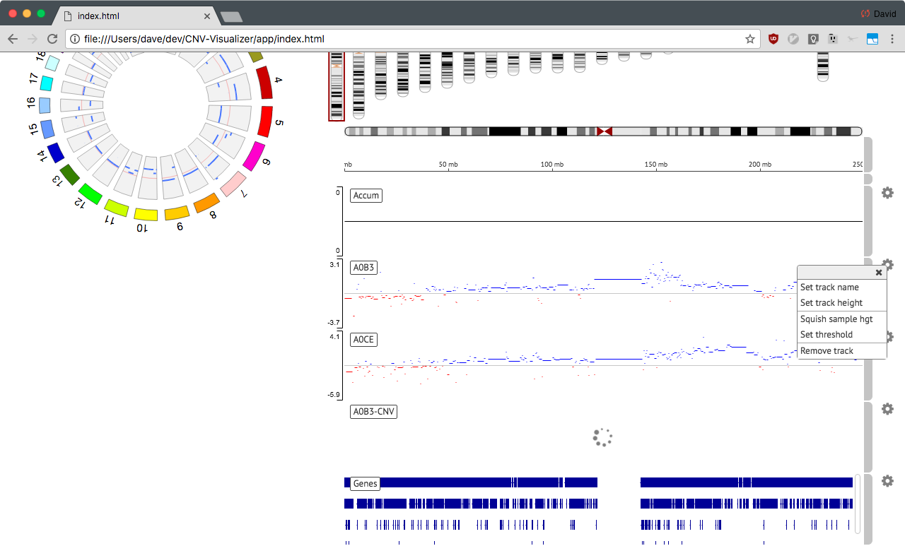
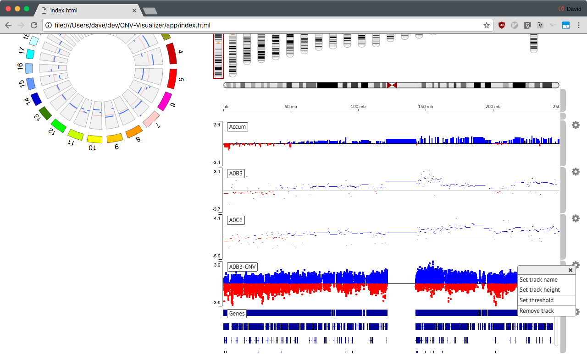
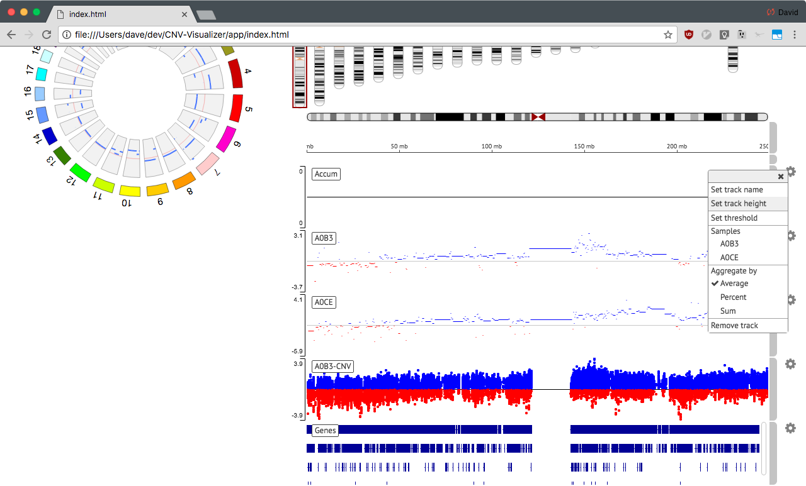

CNVisualizer User Guide
=======================

.. note:: This is subject to change, mostly minor aesthetic changes.

Loading Tracks
--------------

In order to view the data, files must be loaded from one of the top two menu
buttons. Choose which button based on where the file is being loaded from:

.. image:: images/buttons.png

#. File from a web server, must support `Range Requests`_.
#. File found locally on the computer.

And then you can input the relevant information, including

* `URL` or `File`, which is the data to be loaded. Track type is inferred off
  of the extension itself.
* `Name`, which can be changed later (todo: ref)
* `Indexed`, can **NOT** be used for local files. When used for URL files,
  it expects the indexed file to have the same `URL`, with the extra indexed
  extension (i.e. http://files.com/a.bam would be http://files.com/a.bam.bai).

Track configuration can be partially controlled with the gear icon, found to
the right of each track. All of the following have an ability to set the
threshold, which determines values that should not be shown. Color controls may
be added in the future.

Segment Track
-------------

Segment tracks have no truly unique options to select from, as the sample
height is a remnant from having multiple segments per track.

CNV Called Track
----------------

CNV called tracks allow controlling the threshold, but that's it.

CNV Accumulated Track
---------------------

Accumulation tracks allow choosing the segment tracks to include in the
aggregation of data, as well as selecting an aggregation method. These can
be seen as above.

#. Selected samples are marked with a checkmark.
#. Enabled aggregation method is marked with a checkmark.

.. _Range Requests: https://developer.mozilla.org/en-US/docs/Web/HTTP/Range_requests

